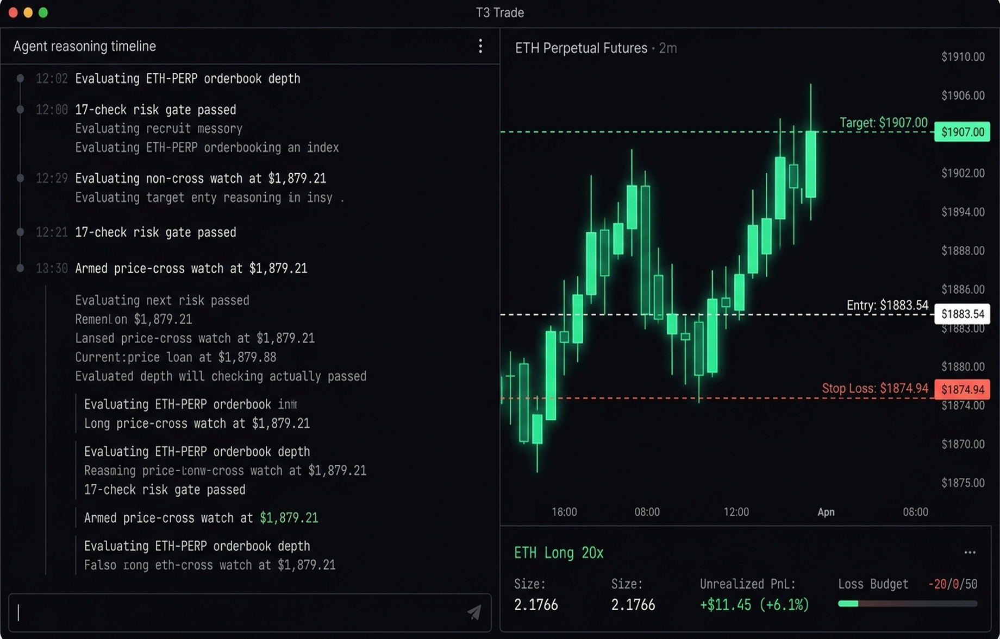

<div align="center">

# T3 Trade

**An Agentic Trading Environment (ATE)** — point a coding agent at a perp
market, give it a written strategy and a loss budget, and let a deterministic
harness hold the rails.

_Alpha · Hyperliquid **testnet only** · macOS + web · MIT_

**[t3trade.mathew.workers.dev](https://t3trade.mathew.workers.dev)** · [Releases](https://github.com/0xgeorgemathew/t3trade/releases)



<sub>A live mission: the agent publishes its plan and belief, arms watches at
its stop and target, and the position card tracks entry, stop, liquidation,
and unrealised PnL against the exchange.</sub>

</div>

---

T3 Trade is a fork of [T3 Code](https://github.com/pingdotgg/t3code), Ping
Labs' open-source control plane for coding agents. Upstream gives you a
control surface for agents working in repositories on your machine. T3 Trade
keeps all of that and adds a second thing an agent can be pointed at: a live
Hyperliquid account, reached through a typed, gated tool surface instead of
shell access.

We call the result an **Agentic Trading Environment**: the agent does the
reading, planning, and explaining; the environment does the enforcing. Every
order the agent proposes passes a deterministic checklist it cannot talk its
way past, every position carries an exchange-native stop, and you can pause,
close, or revoke the whole mission without the agent's cooperation.

> [!CAUTION]
> This is alpha software that places real orders on a real exchange. It is
> built and tested against **Hyperliquid testnet only** — there is no mainnet
> configuration and none should be added casually. Read the
> [safety model](#safety-model) before running anything.

## What it does today

A **mission** binds one agent thread to one market with a written strategy, a
maximum-loss budget, and an expiry. From there the harness runs on its own:

- **Wakes on market events, not on a timer.** The agent registers watches — a
  price cross, an unrealised-PnL level, a candle close — and is resumed only
  when one fires, with a fresh snapshot of the account, position, resting
  orders, and remaining budget.
- **Every order passes a 17-item deterministic preview first.** Mandate,
  leverage, gross notional, exchange minimums, price-band and BBO freshness
  checks, the reservation ledger, and a mandatory stop-loss all run before
  anything is signed. A failed check is a rejected order, whatever the agent
  argues.
- **No position stays unprotected.** Every acknowledged increase must have a
  confirmed exchange-native reduce-only stop resting against it, reconciled
  against the _canonical_ position size read back from the exchange — not the
  size that was submitted.
- **Seven controls that never need the agent.** Pause, resume, cancel entries,
  reduce by 25/50/75/100%, close, revoke, and close-and-revoke all execute
  deterministically, even with the agent's provider process stopped.
- **Idempotent submission.** A deterministic client order id plus a local
  idempotency key means a retried request returns the existing record instead
  of placing a second order.
- **Loss accounting as pure functions.** Budget, reservation, and exhaustion
  math is property-tested contract code; an exhausted budget blocks new
  exposure while preserving the stops that protect what's already open.

Positions, orders, and fills are always read back from the exchange. The
database records what T3 Trade _did_; the exchange remains the authority on
what is _true_.

### What it does not do

It does not pick strategies for you, promise returns, or run unattended
against real funds. It is a harness for supervised, budgeted experiments on
testnet — the interesting claims are about **containment**, not alpha.

## Running it

You need Node.js (`^22.16 || ^23.11 || >=24.10`), the `vp` command, and at
least one coding-agent CLI installed and authenticated.

```bash
curl -fsSL https://vite.plus | bash
```

```bash
vp i
```

```bash
pnpm dev
```

`pnpm dev` starts the server and the web app locally. A packaged macOS
(Apple Silicon) desktop build is published on
[GitHub Releases](https://github.com/0xgeorgemathew/t3trade/releases); other
platforms run from source.

Supported agent providers (install and log in to at least one):

- Claude: [Claude Code](https://claude.com/product/claude-code) — `claude auth login`
- Codex: [Codex CLI](https://developers.openai.com/codex/cli) — `codex login`
- Cursor: [Cursor CLI](https://cursor.com/cli) — `agent login`
- Grok Build: [Grok Build CLI](https://x.ai/cli) — `grok login`
- OpenCode: [OpenCode](https://opencode.ai) — `opencode auth login`

Without a signer key (below), everything runs **read-only**: you can create
missions, watch markets, and see what the agent would do, but nothing is
signed or submitted.

## The interim signer key

Hyperliquid is a signed-order exchange — every order must be signed by a key
that controls the account. T3 Trade does not yet have wallet onboarding or
scoped agent-key management, so for now live execution uses a single
**interim signer key** that you provision yourself, and that key doubles as
the arming switch:

- Place it at `~/.t3trade/secrets/hyperliquid-interim-signer-key.bin` (base
  directory overridable via `T3TRADE_HOME`), or set
  `T3_TRADES_INTERIM_SIGNER_KEY`. Every instance — dev server, worktree,
  packaged desktop app — reads that same location.
- **Key present → the server will place real testnet orders. No key → the
  gate stays unarmed and the server is read-only.** There is no second flag.
- The key never appears in logs, reports, or the database, and must never be
  committed. Use a testnet-funded key only.

This is deliberately blunt for the alpha: one key, one location, one
behavior. Proper key management is future work.

## Safety model

- **Testnet only.** No mainnet configuration exists.
- **The signer key is the gate** — see above.
- **`T3_TRADES_LIVE_EXECUTION=1` gates the live smoke tests only.** It is
  read by `packages/hyperliquid`'s test suite and never by the server.
- **Leave the account flat.** After any live run, close the position and
  cancel resting orders.

## Layout

| Path                                     | What lives there                                                       |
| ---------------------------------------- | ---------------------------------------------------------------------- |
| `packages/trading-contracts`             | Schemas and pure rules — preview checklist, protection, risk equations |
| `packages/hyperliquid`                   | The exchange client: signing, info reads, WebSocket                    |
| `apps/server/src/trading`                | Mission state machine, execution, reconciliation, controls             |
| `apps/web/src/components/trading`        | The mission workspace and risk chrome                                  |
| `apps/marketing`                         | The T3 Trade site                                                      |
| `docs/architecture/trading-execution.md` | Design notes for the execution path                                    |
| `docs/upstream/`                         | The fork's contract with upstream — baseline, patch ledger, runbook    |

Everything outside those paths is upstream T3 Code and is kept close to it so
syncs stay cheap. See [`docs/upstream/PATCH_LEDGER.md`](./docs/upstream/PATCH_LEDGER.md)
for every intentional divergence.

## Documentation

- [Install and first run](./docs/user/install.md)
- [Trading execution and reconciliation](./docs/architecture/trading-execution.md)
- [Architecture overview](./docs/internals/overview.md)
- [Upstream baseline and sync runbook](./docs/upstream/SYNC_RUNBOOK.md)
- [Glossary](./docs/internals/glossary.md)

## Upstream

T3 Trade tracks `pingdotgg/t3code` at the commit pinned in
[`docs/upstream/BASELINE.md`](./docs/upstream/BASELINE.md). The `upstream`
remote is fetch-only. Upstream's own README, install instructions, and
support channels are the place to go for anything that is not trading — this
fork does not accept contributions upstream is better placed to take.
